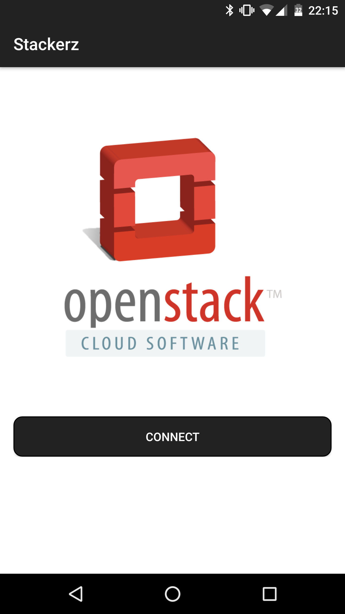
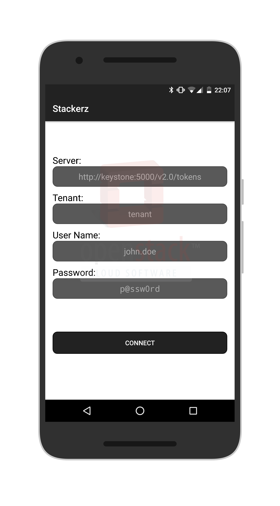
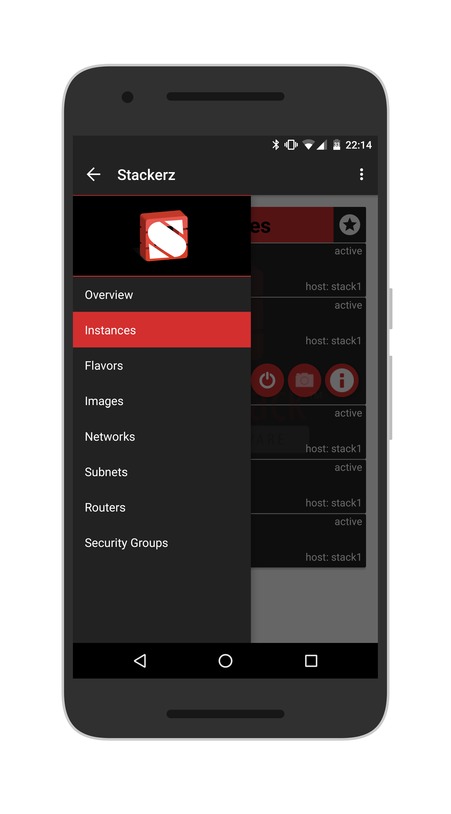
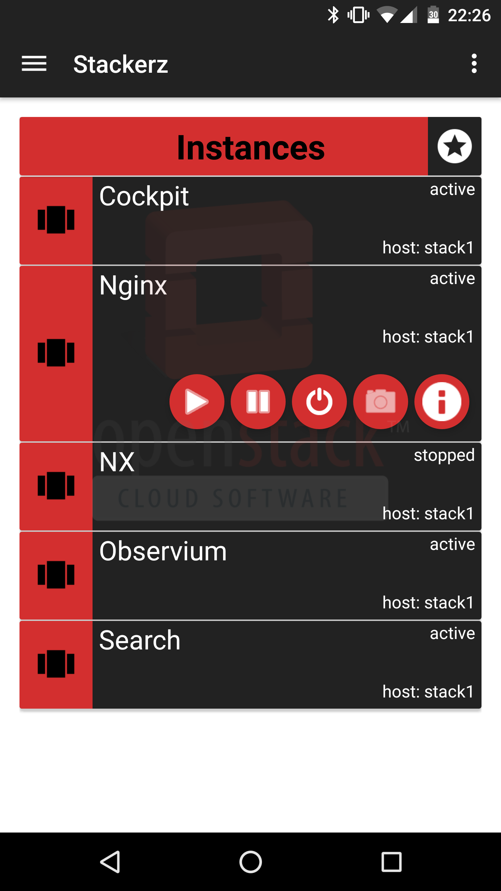
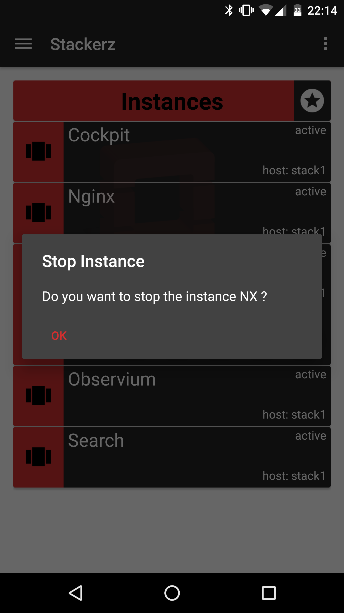
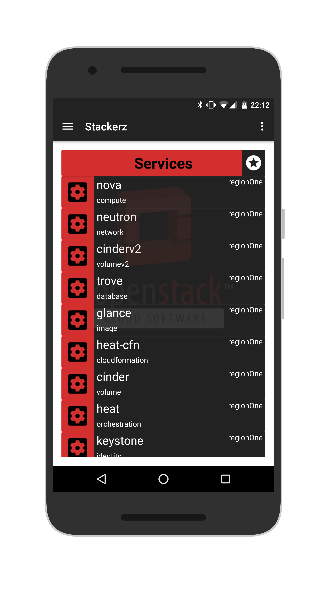

#Stackerz

This is an Android app I developed to manage OpenStack Juno 2014.2.4 services, instances and objects.

It is unfinished and I had to cease develpoment due to lack of time and other reasons. Feel free to fork and use the code!

#Screenshots

  
  
  
  
  
  

